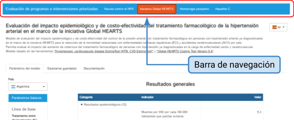
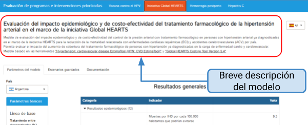
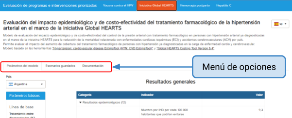
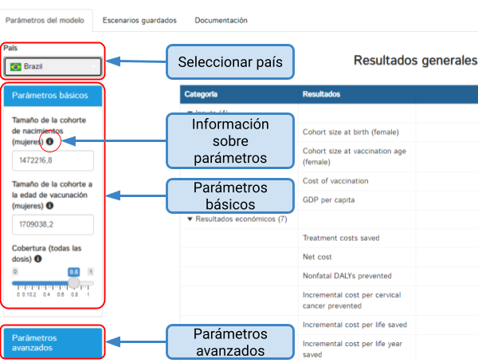
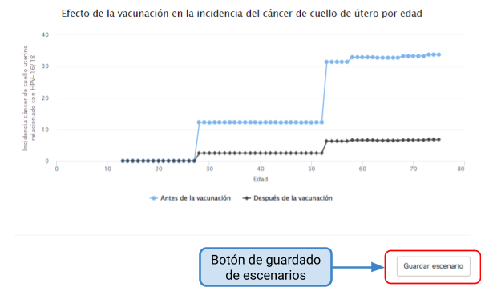
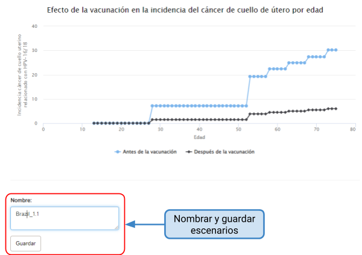
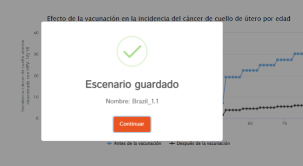
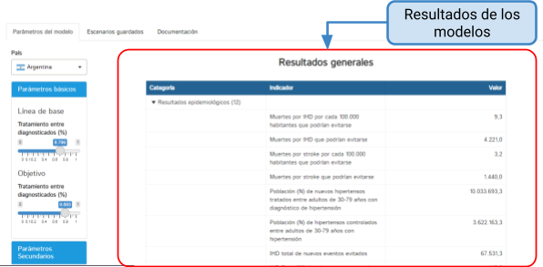
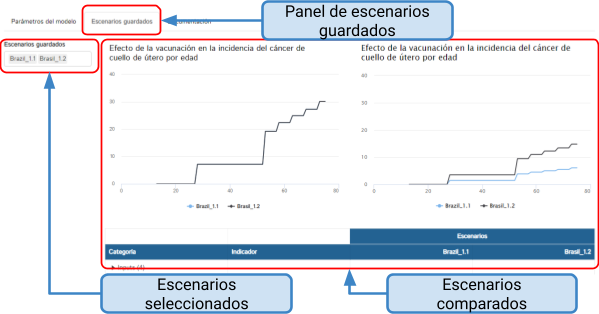

## 1. Introducción

### Propósito del Manual

Este manual tiene como objetivo proporcionar a los usuarios la información necesaria para utilizar el **PAHO Programme Impact Assessment Tool (PIA Tool)** de manera efectiva y eficiente. Está diseñado para guiar a los usuarios a través de la herramienta, desde la configuración inicial hasta la interpretación de resultados, proporcionando instrucciones claras y consejos prácticos para una experiencia de usuario fluida y productiva.

### Descripción general del aplicativo

Nuestra aplicación web es una herramienta diseñada para apoyar la toma de decisiones informadas basadas en los resultados de los modelos. Ofrece una amplia gama de capacidades de modelado predictivo con parámetros personalizables, lo que permite la evaluación detallada de diversos escenarios de intervención en salud pública en diferentes países.

Las características clave de este aplicativo incluyen:

* **Modelos Predictivos parametrizables**: Ofrecemos diferentes modelos para medir el impacto de diferentes intervenciones, todos ellos personalizables según sus necesidades. Esto le permite adaptar los modelos a situaciones específicas.
* **Visualización Interactiva**: La herramienta permite explorar los resultados con gráficos interactivos y tablas.
* **Descarga de Reportes Comparativos**: La herramienta permite descargar informes detallados que comparan los diferentes escenarios que usted haya configurado.

## 2. Requisitos del Sistema

Para garantizar un funcionamiento óptimo de nuestra herramienta web es importante cumplir con los siguientes requisitos del sistema:

### Requisitos de Hardware
   
   * **Procesador**: Se recomienda un procesador de al menos 1 GHz para un rendimiento fluido.
   * **Memoria RAM**: Se sugiere tener al menos 4 GB de RAM para manejar eficientemente los cálculos y la visualización de datos.
  * **Conexión a Internet**: Es esencial contar con una conexión a Internet estable y de alta velocidad para acceder a la herramienta y cargar datos de manera eficiente.

### Requisitos de Software

  * **Navegador Web**: La herramienta está completamente basada en web y se ejecuta en navegadores web modernos. Se ha probado y es compatible con los siguientes navegadores web:
        * Google Chrome (versión más reciente)
        * Mozilla Firefox (versión más reciente)
        * Microsoft Edge (versión más reciente)
        * Asegúrese de tener uno de estos navegadores web instalados y actualizados en su sistema.
        
* **Compatibilidad Móvil**
    * Esta herramienta web es completamente compatible con dispositivos móviles, como teléfonos celulares y tabletas. Puede acceder y utilizar la herramienta de manera efectiva desde su dispositivo móvil, lo que le brinda la flexibilidad de analizar datos y visualizar sus resultados.

## 3. Interfaz de Usuario

La interfaz de usuario de la herramienta consta de un menú principal en la** barra superior de navegación **(figura 1) que incluye los siguientes componentes o intervenciones que conforman la herramienta:

* **Vacuna contra el HPV**: Esta sección le permite explorar y evaluar el Modelo de evaluación del impacto epidemiológico y de costo-efectividad de la vacunación contra el virus del papiloma humano (VPH) en niñas para la prevención del cáncer de cuello uterino por país.Este modelo sirve para evaluar el impacto del aumento de cobertura de vacunación contra el VPH para las niñas en la carga de enfermedad por cáncer de cuello uterino. Está basado en la herramienta [Papillomavirus Rapid Interface for Modelling and Economics (PRIME)](https://primetool.org/).
* **Iniciativa Global HEARTS**: Esta sección le permite explorar y evaluar el Modelo de evaluación del impacto epidemiológico y de costo-efectividad del control de la presión arterial con tratamiento farmacológico en personas con hipertensión arterial ya diagnosticadas en el marco de la iniciativa HEARTS para la reducción de la mortalidad relacionada con enfermedades cardíacas isquémicas (ECI) y accidentes cerebrovasculares (ACV) por país. Este modelo sirve para evaluar el impacto del aumento de cobertura del tratamiento farmacológico de personas con hipertensión ya diagnosticadas en la carga de enfermedad cardio y cerebrovascular. Está basado en las herramientas “[Hypertension: cardiovascular disease EstimaTool (HTN: CVD EstimaTool)](https://www.paho.org/es/enlace/herramienta-para-estimar-impacto-control-poblacional-hipertension-mortalidad-por-ecv)”  y "[Global HEARTS Costing Tool Version 5.4](https://www.tephinet.org/tephinet-learning-center/tephinet-library/hearts-costing-tool)" 
* **Hemorragia Postparto**: Esta sección le permite explorar y evaluar el [Modelo de evaluación del impacto epidemiológico del uso de oxitocina](https://europepmc.org/article/pmc/4461298) durante el parto para la prevención de hemorragia postparto y mortalidad materna por país. Este modelo sirve para evaluar el impacto del aumento de cobertura del uso de oxitocina durante el parto en la carga de enfermedad por hemorragia postparto.
* **Hepatitis C**: Modelo de evaluación del impacto epidemiológico y de costo-efectividad del tratamiento de Hepatitis C crónica para la reducción de la morbimortalidad por Hepatitis C por país. Este Modelo sirve para evaluar el impacto del aumento de la cobertura de tratamiento de Hepatitis C crónica para personas ya diagnosticadas, con distintos estadíos de fibrosis hepática y que nunca han realizado tratamiento, en la carga de enfermedad por Hepatitis C Crónica. Está basado en el modelo “[Hep C Calculator](https://www.hepccalculator.org/about-the-calculators/calculator)”

 
Cuando seleccione una de estas intervenciones, se abrirá una pantalla que consta de:

* **Breve Descripción del Modelo (figura 2):** En la parte superior de la pantalla, encontrará una breve descripción del modelo correspondiente a la intervención seleccionada. Esta descripción proporciona una visión general de los objetivos y el alcance del modelo de impacto.
* **Botón de selección de idioma** (funcionalidad en desarrollo): Permite seleccionar el idioma en el cual visualizar los textos del aplicativo.

 
* **Menú de Opciones (figura 3)**: Justo debajo de la descripción del modelo, encontrará un segundo menú con las siguientes opciones:
    * **Parámetros del modelo**: Esta opción le permite explorar y configurar el modelo, ajustando los parámetros según sea necesario. Desde el panel lateral izquierdo, podrá seleccionar el país con el que desea trabajar en ese escenario. Además, podrá visualizar debajo los parámetros utilizados y modificarlos si lo considera necesario. Los parámetros se dividen en dos categorías: "Parámetros Básicos" y "Parámetros Avanzados". Los parámetros avanzados ofrecen un mayor nivel de control y personalización del modelo. A la derecha, en la sección de “Resultados generales” se muestran las estimaciones del modelo en base a los parámetros seleccionados. Una vez que haya seleccionado el país y modificado los parámetros según sus necesidades, puede proceder a guardar el escenario haciendo clic en el botón ubicado al final de la página.
    * **Escenarios Guardados**: En esta sección, puede acceder a los escenarios previamente guardados para comparar resultados o hacer un seguimiento de sus análisis anteriores. El botón de descarga le permite obtener informes en formato PDF de los escenarios guardados. Desde el panel lateral izquierdo, podrá ver los escenarios guardados junto con los nombres que usted eligió. También tendrá la opción de eliminarlos desde esta sección si necesita descartarlos para que no aparezcan en los informes. Tenga en cuenta que una vez eliminado un escenario, no podrá recuperarlo y deberá generar uno nuevo desde la página principal si así lo requiere.
    * **Documentación**: Desde esta opción puede acceder a información detallada sobre la metodología utilizada en el modelo, incluyendo fuentes de datos, referencias bibliográficas, definición de indicadores y supuestos de los modelos. 

## 4. Estimación de escenarios

Estimar un escenario en nuestra herramienta es un proceso fundamental que le permite analizar y visualizar resultados específicos basados en los parámetros que elija. A continuación, se detallan los pasos para llevar a cabo este proceso de manera efectiva:

### Configuración de Parámetros (figura 4)
    1. **Seleccionar País**: En el panel lateral izquierdo de la pantalla de "Escenario Principal," comience seleccionando el país con el que desea trabajar en su análisis.
    2. **Ajuste de Parámetros**: Debajo de la selección del país, encontrará una lista de parámetros que influyen en el modelo.  Los parámetros difieren entre las diferentes intervenciones y todos contienen valores predeterminados que usted podrá modificar. Estos parámetros se dividen en dos categorías: "Parámetros Básicos" y "Parámetros Avanzados."
    3. **Parámetros Básicos**: Estos son los factores esenciales para su análisis. Puede ajustarlos según sus necesidades y preferencias. Haga clic en los campos correspondientes y modifique los valores según sea necesario.
    4. **Parámetros Avanzados**: Si busca un mayor nivel de control y parametrización del modelo, expanda la sección de "Parámetros Avanzados." Aquí, encontrará opciones adicionales que permiten una personalización más detallada. Al igual que con los parámetros básicos, ajuste los valores según sus requisitos específicos.

### Información sobre Parámetros (figura 4): 
Para obtener una comprensión más completa de cada parámetro, coloque el cursor sobre el icono de información (i) junto al nombre del parámetro. Esto le proporcionará definiciones y detalles importantes sobre el parámetro correspondiente. Podrá encontrar información adicional sobre el modelo en el menú, solapa “Documentación”.

### Resultados
Con cada cambio de los parámetros el modelo estima los resultados que se verán reflejados en el campo de la derecha, “Resultados generales”.

 
4. **Guardado de un escenario (figura 5-7):** Una vez que haya configurado todos los parámetros según sus necesidades, proceda a guardar el escenario haciendo clic en el botón correspondiente al final de la página, sobre el lado derecho (figura 5). Una vez presionado el botón **se desplegará un campo para asignar un nombre a ese escenario guardado** (figura 6). Esto almacenará su configuración para futuras referencias y análisis dentro de esta misma sesión. Se recomienda que el nombre del escenario contenga el nombre del país sobre el cual se realizó seguido de un número o letra como referencia ya que podrá generar más de un escenario por país. Ej. “Brazil_1.1”, “Brazil_1.2”. Los escenarios permanecerán guardados mientras se continúe con la sesión activa (duración sin actividad de 15 minutos). La herramienta permite guardar hasta 6 escenarios diferentes. Finalmente aparecerá un mensaje confirmando que el escenario fue guardado (figura 7).

 

 

 
5. **Visualización de Outputs (figura 8)**: Después de estimar un escenario con los parámetros configurados, la herramienta generará una serie de resultados en el panel principal (“Resultados Generales”) que le proporcionarán información valiosa sobre los resultados de su análisis. Estos pueden variar según la intervención y los parámetros seleccionados, pero en general, incluye lo siguiente:
    5. **Tablas de indicadores**: Además de los gráficos, se proporcionará información detallada sobre los resultados en formato de tablas, con los indicadores clasificados en resultados económicos y resultados epidemiológicos.
    6. **Gráficos Interactivos**: La herramienta generará gráficos interactivos que representan visualmente los resultados de su escenario. Puede explorar estos gráficos para comprender mejor las tendencias y patrones.

## 5. Comparación de escenarios

Comparar escenarios es una función valiosa que le permite analizar y contrastar diferentes configuraciones de parámetros o situaciones de intervención. Para realizar comparaciones de escenarios en nuestra herramienta, siga estos pasos (figura 9):

1. **Acceda al Panel de "Escenarios Guardados"**: Desde el menú principal, seleccione la opción "Escenarios Guardados". Esto lo llevará a una sección donde puede ver y administrar los escenarios previamente guardados.
2. **Seleccione Escenarios para Comparar**: En el panel lateral izquierdo podrá visualizar los escenarios que tiene guardados en su sesión. Desde allí puede borrar los escenarios que desea descartar. Recuerde que una vez borrados no los podrá recuperar y deberá generarlos nuevamente. Los escenarios allí listados son los que podrá comparar. 
3. **Examine los resultados comparativos**: Una vez que haya seleccionado los escenarios deseados, podrá visualizar los output y compararlos en el panel principal. La herramienta generará gráficos y tablas que muestran las diferencias y similitudes entre los escenarios seleccionados. Puede explorar estos resultados en un reporte con formato PDF descargable desde el botón “descargar” ubicado al final de la pantalla principal (funcionalidad en desarrollo).

 

## 6. Preguntas Frecuentes (FAQ)

En construcción

 
## 7. Contacto y Soporte Técnico

sesteban@iecs.org.ar

